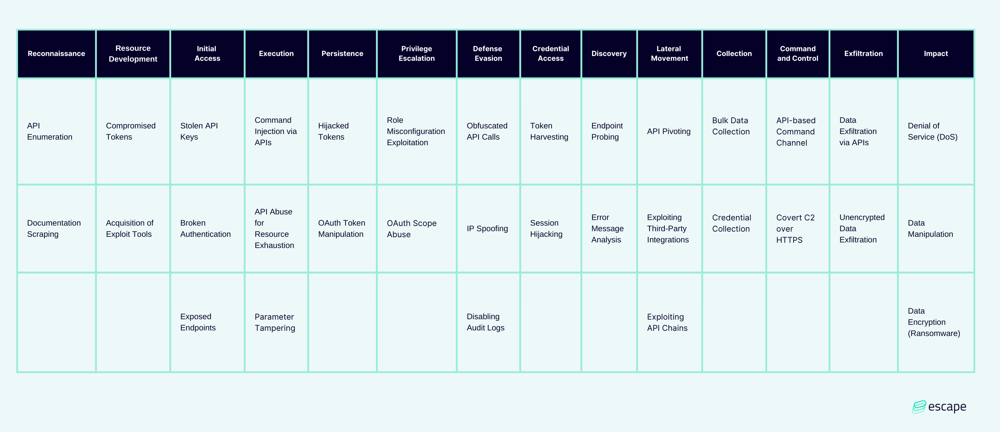

# Common Threat Matrix for APIs
This is an ATT&CK-like matrix focused on API-specific risk. Using the [MITRE ATT&CK®](https://attack.mitre.org/)  framework as a base, we collected techniques and attack vectors associated with APIs and created a matrix dedicated to API attack methods.

Our goal for developing the threat matrix for API security is to build a comprehensive knowledgebase that defenders can use to keep track of and build defenses against relevant attack techniques. 

We’re looking to continuously improve the matrix, so any feedback is welcome! 

## Table of Contents
- [Background](#background)
- [Threat Matrix](#threat-matrix)
- [Techniques and Mitigation](#techniques-and-mitigation)
    - [Reconnaissance](#reconnaissance)
    - [Resource Development](#resource-development)
    - [Initial Access](#initial-access)
    - [Execution](#execution)
    - [Persistence](#persistence)
    - [Privilege Escalation](#privilege-escalation)
    - [Defense Evasion](#defense-evasion)
    - [Credential Access](#credential-access)
    - [Discovery](#discovery)
    - [Lateral Movement](#lateral-movement)
    - [Command and Control](#command-and-control)
    - [Exfiltration](#exfiltration)
    - [Collection](#collection)
    - [Impact](#impact)
- [Adaptation to the different API types](#adaptation-to-the-different-api-types)
    - [GraphQL](#graphql)
    - [REST](#rest)
    - [gRPC](#grpc)
- [Other API security-related security research](#other-api-security-related-security-research)

## Background
This matrix aims to share knowledge on securing APIs with the Cybersecurity community.  
This matrix was created by the security research team at Escape.

## Threat Matrix

## Techniques and Mitigation

Each technique is aligned with MITRE ATT&CK's framework of adversary tactics, techniques, and procedures (TTPs), structured according to:

* Reconnaissance: Attackers gather information about API endpoints.
* Resource Development: Attackers acquire tokens, credentials, or tools to attack the API.
* Initial Access: Attackers gain entry to the API through stolen keys or exposed endpoints.
* Execution: Techniques for injecting commands or manipulating the API's behavior.
* Persistence: Techniques for maintaining access, such as token hijacking.
* Privilege Escalation: Elevating access by exploiting roles or token scopes.
* Defense Evasion: Obfuscating API traffic or disabling logging to avoid detection.
* Credential Access: Stealing or hijacking session tokens and other credentials.
* Discovery: Finding hidden or undocumented API endpoints.
* Lateral Movement: Moving between API services to access more data.
* Command and Control: Using APIs for covert communication channels.
* Exfiltration: Extracting data from API endpoints.
* Collection: Gathering data for exfiltration, including credential harvesting.
* Impact: Denial of Service (DoS) attacks, data manipulation, or ransomware.

## API-Specific ATT&CK-like Matrix

| **Tactic**              | **Technique**                    | **Description**                                                                                      | **Mitigation**                                                                                   |
|-------------------------|-----------------------------------|------------------------------------------------------------------------------------------------------|---------------------------------------------------------------------------------------------------|
| **Reconnaissance**       | **API Enumeration**              | Attackers probe API endpoints using brute-force or automated tools to identify open APIs.             | Use API gateways to filter traffic, apply rate limiting, and hide internal APIs.                   |
|                         | **Documentation Scraping**       | Attackers exploit public-facing documentation to identify potential vulnerabilities or weak spots.    | Regularly review and sanitize public documentation to avoid leaking sensitive implementation info. |
| **Resource Development** | **Compromised Tokens**           | Attackers acquire API tokens from previous breaches or through social engineering.                    | Regularly rotate API tokens and enforce MFA for token generation.                                 |
|                         | **Acquisition of Exploit Tools** | Attackers acquire or build tools to target vulnerabilities in API implementations.                   | Use threat intelligence to detect tool use, apply input validation, and use API security scanning. |
| **Initial Access**       | **Stolen API Keys**              | API keys are compromised via public repositories, misconfigurations, or phishing attacks.             | Store API keys securely, implement key rotation, and avoid embedding them in public codebases.     |
|                         | **Broken Authentication**        | Attackers exploit weak or absent authentication mechanisms, including missing MFA or weak passwords.  | Enforce MFA, use OAuth 2.0, and validate session tokens properly.                                 |
|                         | **Exposed Endpoints**            | Attackers gain unauthorized access to APIs via publicly exposed or undocumented API endpoints.        | Limit access via IP whitelisting, monitor traffic with logging, and use API gateways.              |
| **Execution**            | **Command Injection via APIs**   | Attackers send malicious inputs to exploit vulnerabilities in APIs to execute arbitrary commands.     | Validate and sanitize input, use prepared statements, and prevent code injection attacks.          |
|                         | **Parameter Tampering**          | Attackers modify API parameters (e.g., manipulating IDs) to bypass access controls.                   | Validate parameters on the server side, sanitize inputs, and enforce strong access controls.       |
|                         | **API Abuse for Resource Exhaustion**  | Attackers flood API endpoints with a high volume of requests or payloads to exhaust system resources. | Implement rate limiting, resource throttling, and monitor for unusual traffic patterns.            |
| **Persistence**          | **Hijacked Tokens**              | Stolen or long-lived tokens allow attackers to maintain persistent access to the API.                 | Use short-lived access tokens, enforce refresh token expiration, and monitor API usage patterns.   |
|                         | **OAuth Token Manipulation**     | OAuth tokens are manipulated to escalate privileges or extend access beyond allowed permissions.      | Properly validate OAuth tokens, set appropriate scopes, and enforce token revocation policies.     |
| **Privilege Escalation** | **Role Misconfiguration**        | Attackers exploit misconfigured roles and permissions to escalate access within the API environment.  | Enforce least privilege, regularly audit RBAC, and apply role validation.                         |
|                         | **OAuth Scope Abuse**            | Attackers exploit excessive OAuth scopes to gain elevated privileges.                                 | Define minimal scopes for each user, validate token claims.                                       |
| **Defense Evasion**      | **Obfuscated API Calls**         | API requests are encrypted or encoded to evade detection and logging.                                | Use deep packet inspection (DPI) tools to monitor encrypted traffic, enable full API logging.      |
|                         | **IP Spoofing**                  | Attackers spoof their IP addresses to bypass geolocation or IP-based access controls.                 | Implement IP reputation services, use geo-blocking, and monitor traffic for abnormal behavior.     |
|                         | **Disabling Audit Logs**         | Attackers attempt to disable or bypass logging mechanisms to avoid detection.                         | Ensure audit logs cannot be disabled by API users, use external monitoring services.               |
| **Credential Access**    | **Token Harvesting**             | Attackers capture API tokens via misconfigurations or compromised services to access APIs.            | Encrypt tokens, use HTTPS for transmission, and avoid exposing tokens in logs or URLs.             |
|                         | **Session Hijacking**            | Attackers intercept active sessions to impersonate legitimate users and access APIs.                  | Implement session timeouts, force re-authentication on critical actions, and use HTTPS for secure communication. |
| **Discovery**            | **Endpoint Probing**             | Attackers brute-force or scan for hidden or undocumented API endpoints to discover more resources.    | Implement rate limiting, log discovery attempts, and enforce endpoint naming conventions.          |
|                         | **Error Message Analysis**       | Attackers analyze verbose error messages to learn about the API's internal structure.                 | Limit error message information, sanitize logs, and return minimal error responses.                |
| **Lateral Movement**     | **API Pivoting**                 | Attackers use compromised APIs to gain access to interconnected services and resources.               | Use micro-segmentation to isolate critical services, implement mutual TLS for service-to-service communication. |                       
|                         | **Exploiting Third-Party Integrations** | Attackers exploit insecure third-party services integrated with the API to pivot and move laterally.  | Validate and secure all third-party integrations, enforce access control policies, audit services. |
| | **Exploiting API Chains**        | Attackers use chained API requests to move between services and escalate access.                      | Apply strong authentication across all services, audit chained API requests.                       |
| **Collection**           | **Bulk Data Collection**         | Attackers gather large amounts of data from vulnerable API endpoints in preparation for exfiltration. | Monitor for unusual data access patterns and enforce strict data access controls.                  |
|                         | **Credential Collection**        | Attackers focus on gathering sensitive credentials through exposed API endpoints or logs.             | Mask sensitive information in API responses, secure logs, and implement strict access control.     |
| **Command and Control**  | **API-based Command Channel**    | Attackers use APIs as a covert command channel to issue commands and control compromised systems.     | Monitor for abnormal API behavior, use rate limiting, and detect anomalous traffic patterns.       |
|                         | **Covert C2 over HTTPS**         | Attackers use API endpoints over encrypted HTTPS to communicate with compromised infrastructure.      | Inspect encrypted traffic for anomalies, use SSL inspection tools.                                |
| **Exfiltration**         | **Data Exfiltration via APIs**   | Attackers extract sensitive data using API endpoints that allow bulk data downloads.                  | Enforce rate limiting, monitor for unusual download patterns, and apply strict access controls.    |
|                         | **Unencrypted Data Exfiltration**| Sensitive data is transmitted via APIs without encryption, allowing attackers to intercept it.        | Enforce TLS for data in transit, encrypt sensitive data at rest.                                  |
| **Impact**               | **Denial of Service (DoS)**      | Attackers flood API endpoints with requests to cause service disruption and make the API unavailable. | Implement rate limiting, use load balancers, and monitor API traffic for anomalies.                |
|                         | **Data Manipulation**            | Attackers modify or corrupt data using legitimate API calls, impacting the integrity of the system.   | Use data validation and integrity checks, log all data changes, and maintain backups for recovery. |
|                         | **Data Encryption (Ransomware)** | Attackers encrypt sensitive data via APIs and demand ransom for decryption.                          | Implement regular data backups, use strong encryption, and apply data integrity monitoring tools.  |

## Adaptation to the different API types

### GraphQL

[GraphQL threat framework by Nick Aleks and Dolev Farhi](https://github.com/nicholasaleks/graphql-threat-matrix)

### REST

| **Tactic**              | **Technique**                    | **Description**                                                                                      | **Mitigation**                                                                                   |
|-------------------------|-----------------------------------|------------------------------------------------------------------------------------------------------|---------------------------------------------------------------------------------------------------|
| **Reconnaissance**       | **REST API Crawling**            | Attackers use automated tools to crawl through REST API endpoints to discover exposed resources.       | Use API gateways, limit endpoint exposure, and apply IP filtering.                               |
|                         | **Swagger/OpenAPI Exploitation** | Attackers exploit public-facing API schemas (Swagger/OpenAPI) to learn about API structure.            | Keep API schemas internal, apply access controls, and sanitize public documentation.              |
| **Resource Development** | **Compromised Tokens**           | Attackers acquire API tokens from previous breaches or through social engineering.                    | Regularly rotate API tokens, enforce MFA for token generation.                                    |
|                         | **Acquisition of REST Attack Tools** | Attackers develop or acquire tools that automate REST API attacks such as rate-limiting bypasses.      | Use threat intelligence to detect these tools, apply rate-limiting rules, and monitor anomalies.   |
| **Initial Access**       | **Compromised API Keys**         | Attackers steal or reuse API tokens exposed in repositories or misconfigured environments.             | Regularly rotate API keys and enforce strict token expiration policies.                           |
|                         | **Broken REST Authentication**   | Attackers exploit weaknesses in REST authentication mechanisms, such as JWT misconfiguration.          | Implement strong JWT token validation, use HTTPS, and enforce MFA.                               |
| **Execution**            | **RESTful SQL Injection**        | Attackers inject SQL queries into API parameters to exploit database vulnerabilities.                  | Use prepared statements, input validation, and escape user inputs.                                |
|                         | **Parameter Tampering**          | Attackers modify REST API parameters to bypass access controls or gain unauthorized access.            | Validate input on the server side, enforce strong access controls, and sanitize user inputs.       |
| **Persistence**          | **Stolen OAuth Tokens**          | Attackers use stolen OAuth tokens to maintain access to RESTful APIs.                                 | Use short-lived OAuth tokens, rotate and revoke tokens as needed, and monitor access logs.         |
|                         | **Abusing API Sessions**         | Attackers maintain persistence by hijacking active REST API sessions.                                 | Implement session expiration policies and enforce re-authentication for critical operations.       |
| **Privilege Escalation** | **Insecure Direct Object References (IDOR)** | Attackers exploit IDOR vulnerabilities to access unauthorized resources by manipulating object references. | Validate access controls and implement object-level access checks.                                |
|                         | **OAuth Scope Abuse**            | Attackers exploit excessive OAuth scopes to escalate privileges within REST APIs.                      | Define minimal scopes for each role, validate token scopes, and monitor OAuth activity.            |
| **Defense Evasion**      | **REST Call Obfuscation**        | Attackers obscure REST API requests to evade security systems and logging.                            | Enable detailed API logging, use API security gateways, and analyze unusual traffic patterns.      |
|                         | **IP Spoofing**                  | Attackers spoof their IP addresses to bypass IP-based access controls in REST APIs.                   | Apply geo-restrictions and use IP reputation services for real-time monitoring.                    |
| **Credential Access**    | **Token Replay Attacks**         | Attackers reuse stolen tokens to impersonate legitimate users and access REST APIs.                    | Implement short-lived tokens, session binding, and replay attack detection mechanisms.             |
|                         | **Session Hijacking**            | Attackers intercept and steal active REST API sessions to access the API.                             | Use HTTPS, apply strong session validation, and enforce re-authentication on sensitive actions.    |
| **Discovery**            | **Endpoint Brute Force**         | Attackers attempt to brute force REST API endpoints to discover hidden or undocumented resources.      | Implement rate limiting, enforce IP restrictions, and monitor for unusual traffic patterns.        |
|                         | **Error Message Analysis**       | Attackers analyze detailed error messages to learn about the internal structure of the API.            | Limit error information, sanitize logs, and return generic error responses to avoid data leakage.  |
| **Lateral Movement**     | **REST API Chaining**            | Attackers use chained REST API calls to access additional services or resources.                       | Enforce strong authentication between API services, use network segmentation, and apply mutual TLS.|
| **Collection**           | **Bulk Data Collection**         | Attackers gather large amounts of sensitive data from unsecured REST API endpoints.                    | Monitor for unusual data access patterns, apply rate limiting, and enforce strict data access controls. |
| **Command and Control**  | **API-based Command Channel**    | Attackers use REST APIs as a covert command channel to control compromised systems.                    | Monitor for abnormal API behavior, use rate limiting, and detect anomalous traffic patterns.       |
|                         | **Covert C2 over HTTPS**         | Attackers use encrypted HTTPS channels through REST APIs to establish command and control (C2).        | Inspect HTTPS traffic using SSL inspection tools, and monitor API requests for anomalies.          |
| **Exfiltration**         | **Bulk Data Extraction**         | Attackers exploit poorly secured REST API endpoints to extract large amounts of data.                  | Implement rate limiting, apply strict access control, and monitor for abnormal download patterns.   |
|                         | **Unencrypted Data Exfiltration**| Sensitive data is transmitted without encryption, allowing attackers to intercept it.                  | Enforce TLS for data in transit, use encryption for sensitive data at rest.                        |
| **Impact**               | **Denial of Service (DoS)**      | Attackers flood REST API endpoints with requests to cause service disruption.                          | Use rate limiting, apply DoS protection tools, and monitor API traffic for abnormal patterns.       |
|                         | **Data Manipulation**            | Attackers modify data using legitimate API calls, affecting the integrity of the system.               | Apply strong data validation, log data changes, and enforce data integrity checks.                 |
|                         | **Data Encryption (Ransomware)** | Attackers encrypt sensitive data via REST APIs and demand a ransom for decryption.                     | Regularly back up data, use strong encryption methods, and monitor for anomalous data changes.      |

### gRPC

| **Tactic**              | **Technique**                    | **Description**                                                                                      | **Mitigation**                                                                                   |
|-------------------------|-----------------------------------|------------------------------------------------------------------------------------------------------|---------------------------------------------------------------------------------------------------|
| **Reconnaissance**       | **gRPC Service Enumeration**      | Attackers enumerate gRPC services using automated tools to discover exposed services.                 | Use mTLS for authentication, hide internal services, and enforce IP restrictions.                 |
|                         | **Reflection Exploitation**       | Attackers exploit the reflection feature of gRPC to learn about available methods and services.        | Disable reflection in production or limit it to authenticated users.                             |
| **Resource Development** | **Acquisition of gRPC Attack Tools** | Attackers acquire tools specifically designed for exploiting gRPC services (e.g., fuzzers).           | Regularly update gRPC libraries, and monitor for signs of exploitation attempts.                   |
| **Initial Access**       | **Stolen API Tokens**            | Attackers gain access through stolen or exposed gRPC tokens.                                          | Use short-lived tokens, enforce strict expiration policies, and regularly rotate keys.            |
|                         | **Exploiting Weak Authentication**| Attackers target gRPC services with weak or absent authentication mechanisms.                         | Implement mTLS, use OAuth 2.0 for authentication, and enforce MFA for critical gRPC services.      |
| **Execution**            | **gRPC Command Injection**        | Attackers inject malicious commands into gRPC payloads by exploiting input validation flaws.           | Validate all gRPC inputs and use protocol buffers to restrict the input structure.                |
|                         | **Excessive Resource Consumption**| Attackers send numerous gRPC requests to exhaust resources and disrupt service availability.           | Implement rate limiting, monitor resource usage, and apply throttling for high-volume requests.    |
| **Persistence**          | **Hijacked Session Tokens**       | Attackers use hijacked tokens or credentials to maintain persistent access to gRPC services.           | Use short-lived tokens, rotate tokens, and enforce re-authentication policies for sensitive actions.|
|                         | **Abusing gRPC Streams**          | Attackers maintain persistence by hijacking long-lived gRPC streams.                                  | Limit stream durations and monitor for abnormal gRPC stream behavior.                             |
| **Privilege Escalation** | **Exploiting RBAC Misconfiguration** | Attackers escalate privileges by exploiting misconfigured role-based access control (RBAC) in gRPC.    | Enforce least privilege principles and regularly audit access control policies.                   |
|                         | **OAuth Scope Abuse**            | Attackers abuse excessive OAuth scopes to gain elevated privileges in gRPC services.                  | Define minimal scopes for each user, validate token claims, and monitor OAuth activity.            |
| **Defense Evasion**      | **Obfuscated gRPC Calls**         | Attackers obscure gRPC requests to evade security detection tools and logging.                        | Enable full logging for gRPC services, use security gateways,

## Other API security-related research
- [API Threat Landscape Database](https://escape.tech/resources/api-threat-landscape)
- [The API secret sprawl report](https://escape.tech/the-api-secret-sprawl-2024)
- [State of GraphQL security 2024](https://escape.tech/resources/the-state-of-graphql-security-2024)

